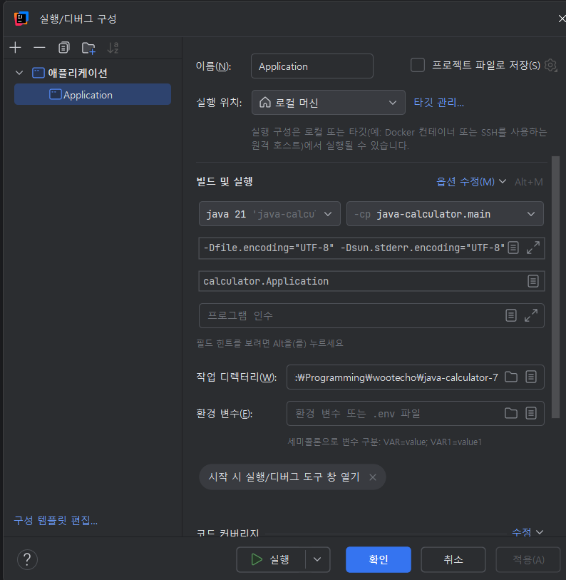

# JAVA 버전 21을 사용 시 인텔리제이 콘솔 한글 깨짐
1. 편집으로 들어간다

2. VM 옵션을 설정한다. 이 때, vm 옵션이 없다면 옵션 수정을 클릭해 VM 옵션을 추가하자.

3. `-Dfile.encoding="UTF-8" -Dsun.stderr.encoding="UTF-8" -Dsun.stdout.encoding="UTF-8"`

위의 명령어들을 추가하고 인텔리제이를 재실행한다.