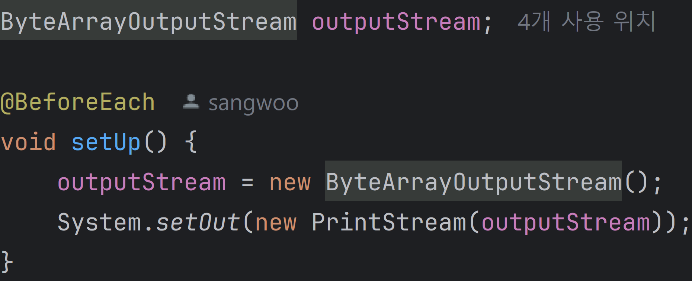
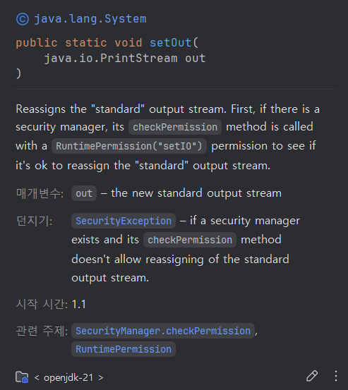
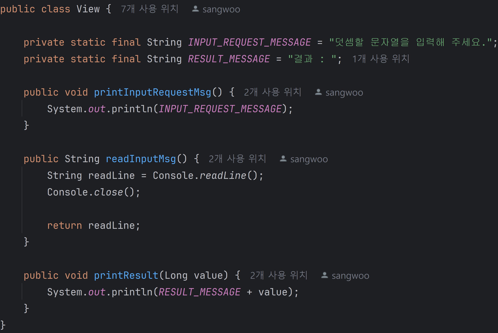
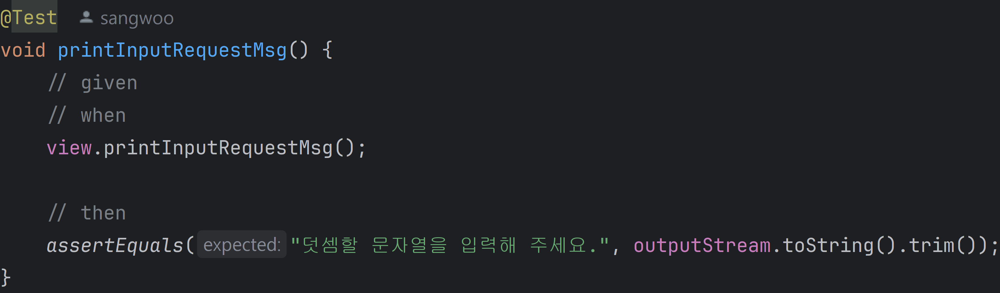
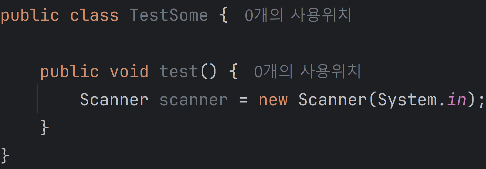
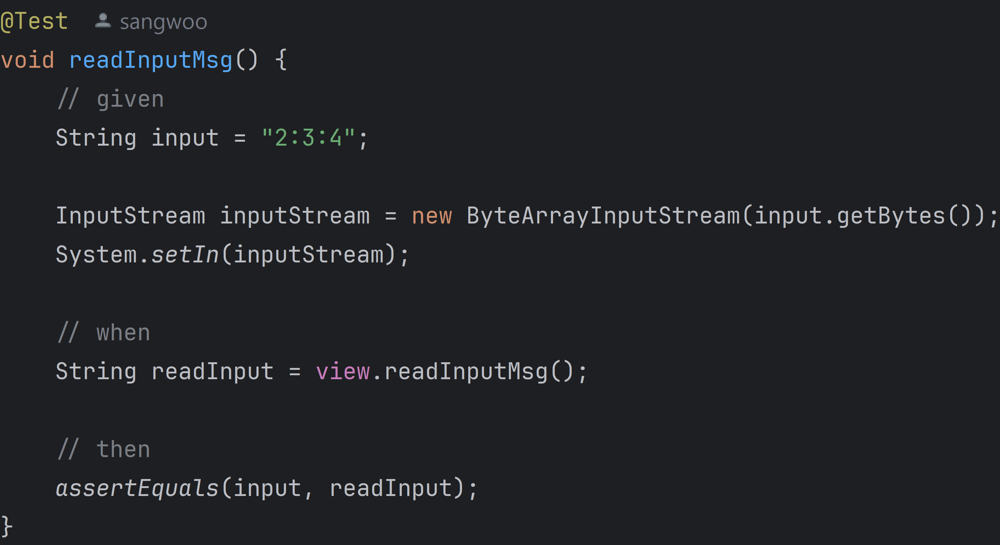

# 콘솔창 입출력 테스트

## 출력 테스트 하기

출력은 `OutPutStream`을 통해 데이터를 전송한다. 그래서 테스트를 위해서 `OutPutStream`을 새로 설정해보기로 하자.

우선 `System.out.println()` 의 `System.out`을 새로운 `OutPutStream`으로 설정해야 한다.

위의 사진을 보면 `System.setOut`을 통해 새로운 `OutPutStream`을 설정해준다. `setOut()`은 `OutPutStream`을 상속받는 `PrintStream`을 매개변수로 받고 `PrintStream`은 `ByteArrayOutPutStream`을 생성자의 매개변수로 받는다.

이렇게 설정을 해주고 실제 테스트를 해보자.

테스트 코드를 보면 `View` 클래스의 `printInputRequestMsg()`를 테스트 한다. 

출력 데이터가 `OutPutStream`에 담겨 있을 때, 해당 `OutPutStream`을 지금 직접 생성해서 설정했기에 사용할 수 있다.

그래서 `OutputStream.toString()`을 사용해 현재 출력할 문자열을 가져오고 이를 검증한다.

## 입력 테스트 하기

입력은 `InputStream`을 사용한다. 콘솔 입력을 위해 `Scanner`를 생성하는 방법을 보자

`Scanner`는 `InputStream`을 생성자 매개변수로 받고 실제 `System.in`을 대입하여 `Scanner`를 사용할 준비를 한다.

여기서 생성자 매개변수를 변경해주면 된다. 

1. 미리 테스트 하기 위한 입력 값을 선언

2. `ByteArrayInputStream`은 byte 배열을 사용하기 때문에 테스트 하기위해 생성한 문자열을 `Byte[]`로 변환하여 매개변수로 넘겨준다.

2. 이제 테스트 문자열이 담긴 `InputStream`을 `System.setIn()`에 넣어주어 우리가 새로 설정한 `InputStream`을 System에서 사용하도록 한다.

4. `View.readInputMsg()` 내부에서 `InputStream`을 받아들이는 작업이 발생하고 입력값을 확인해보면 우리가 지정한 문자열이 나올 것이다.