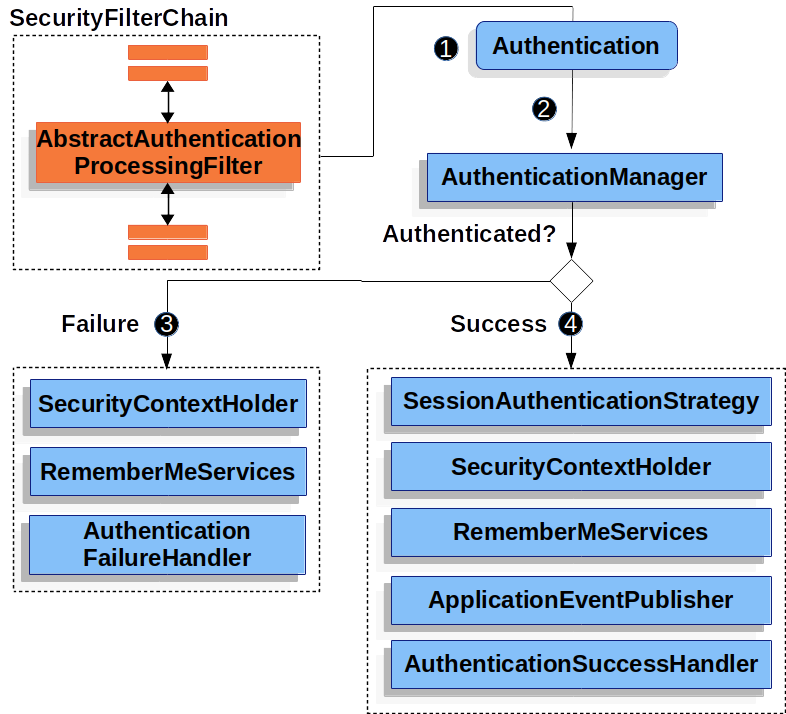

# 로그인 성공 시 사용자 권한 별로 리다이렉트 페이지 분리하기

> https://docs.spring.io/spring-security/reference/servlet/authentication/architecture.html#servlet-authentication-abstractprocessingfilter



`AbstractAuthenticationProcessingFilter`는 인증이 성공하면 `AuthenticationSuccessHandler`가 `onAuthenticationSuccess()`를 호출한다.

우리는 이 `onAuthenticationSuccess()`를 구현하여 로그인 성공 시 사용자 권한 별로 리다이렉트를 나눌 수 있다. 

```JAVA
@Slf4j
public class CustomAuthenticationSuccessHandler implements AuthenticationSuccessHandler {

    @Override
    public void onAuthenticationSuccess(HttpServletRequest request, HttpServletResponse response, Authentication authentication) throws IOException, ServletException {
        log.info("[CustomAuthenticationSuccessHandler] onAuthenticationSuccess() CALL");

        if (authentication.getAuthorities().contains(new SimpleGrantedAuthority("ROLE_USER"))) {
            response.sendRedirect("/");
        } else if (authentication.getAuthorities().contains(new SimpleGrantedAuthority("ROLE_ADMIN"))) {
            response.sendRedirect("/admin");
        } else {
            response.sendRedirect("/login?error=unauthorized");
        }
    }
}
```

`AuthenticationSuccessHandler`를 구현하여 `onAuthenticationSuccess()`를 완성해주자. 완성한 `CustomAuthenticationSuccessHandler`를 스프링 시큐리티가 사용하도록 설정해주자.

```java
@Bean
    public SecurityFilterChain securityFilterChain(HttpSecurity http) throws Exception {

        http
                .formLogin(formLogin -> formLogin
                        .loginPage("/login")
                        .loginProcessingUrl("/login")
                        .defaultSuccessUrl("/home", true)
                        .successHandler(new CustomAuthenticationSuccessHandler())
                )

        return http.build();
    }
```

`formLogin`과 관련된 설정만 가져왔다. 여기서 `formLogin().successHandler(new CustomAuthenticationSuccessHandler())`로 직접 구현한 handler를 넣어준다.